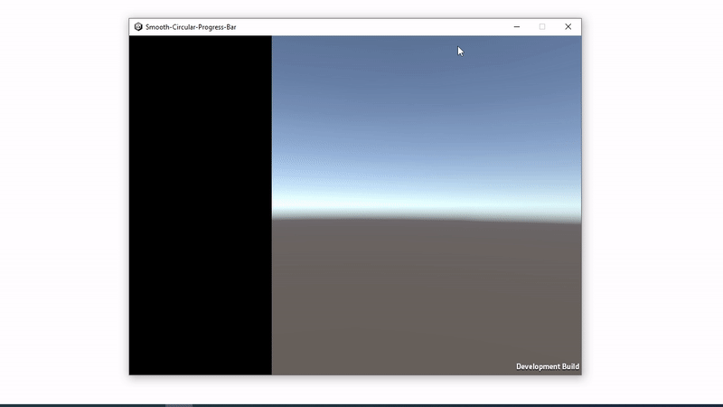
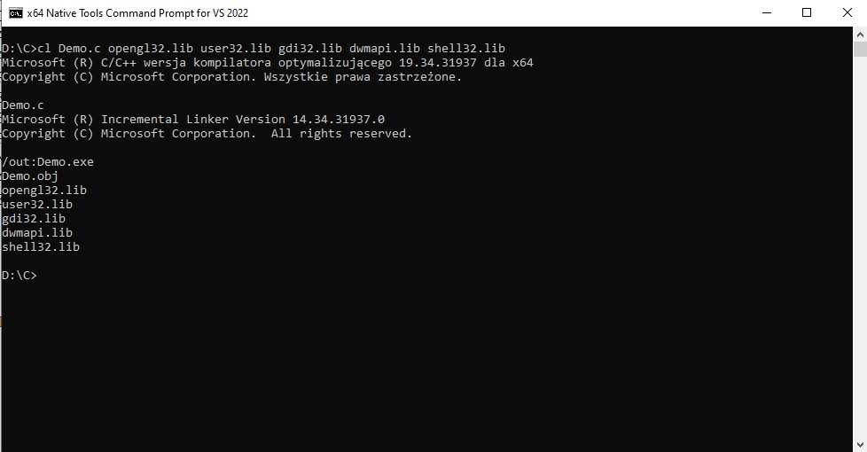

# Unity: Smooth Circular Progress Bar

I present an idea how to create progress bars, which will work without freezes even during computationally expensive tasks. 

Dealing with native plugins, threads and synchronization in Unity engine still can be complex and error-prone.

So, maybe just... create another process to do all the work! It is crazy idea, but it works! 

The downside of this solution may be the fact that we have to ensure that this process effectively imitates the behavior of the progress bar, 
create an illusion as if the bar is still part of the main application.

Because another process is just another window application. But with WinAPI we can make the window look like an overlay, using transparency.

Here's a breakdown of the code (Demo.c) and its functionality:

* Header Inclusions: The code includes various header files required for Windows API functions, OpenGL, and other necessary libraries.

* Function Pointer Declarations: The code declares function pointers for various OpenGL and Windows API functions. These function pointers are used to load the required functions dynamically at runtime.

* wglInit Function: This function initializes the OpenGL context. It creates a hidden window and sets up the OpenGL context for that window.

* glInit Function: This function initializes various OpenGL function pointers using the previously declared function pointers.

* VertexShader and FragmentShader: These are string constants that hold the source code for the vertex and fragment shaders. The shaders define how vertices are transformed and how fragments (pixels) are colored.

* BuildShaders Function: This function compiles and links the vertex and fragment shaders into a complete shader program. It returns the ID of the created program.

* IsTextEqual Function: This function compares two character arrays for equality.

* WindowProc Function: This is the window procedure that handles various window messages, such as closing the window.

* WinMain Function: This is the entry point of the application. It initializes the application and enters the main message loop. Within the loop, it continuously updates the progress bar based on time and the visibility of the specified window. The progress bar is drawn using shaders, and its appearance is influenced by the ProgressBar function within the fragment shader.

To set size and thickness of the progress bar, see line 120 in Demo.c

Compile C program with Visual Studio Command Line:

cl Demo.c opengl32.lib user32.lib gdi32.lib dwmapi.lib shell32.lib

then move executable (Demo.exe) into Assets/StreamingAssets

To set screen position of the progress bar (relative to top left corner of Unity app), set Offset in Demo.cs component (scene SampleScene).

Tested with Unity 2021.3.15f1

